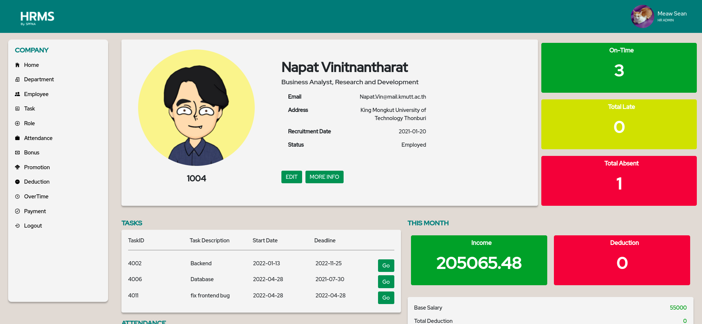
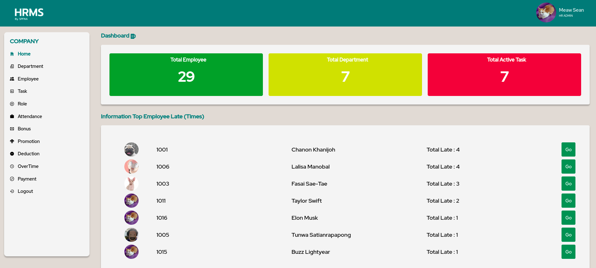

# HRMS by SPFNA | Human Resource Management System

HRMS by SPFNA is HR management system 
(CPE 231 KMUTT Database Design Project)

## Example






## Dev tools

1. Frontend - react,react-boostrap
2. Backend - node, express
3. Database - MySql XAMPP

## Feature 

- Add new employee to database
- Assign task to employee 
- Promote employee
- Create overtime (OT) task
- Check employee Attendance
- Assign bonus to each employee

## Run the web

create .env file
```
PORT= 
DB_USER=""
DB_HOST=""
DB_PASSWORD=""
DB_NAME=""

ACCESS_TOKEN = 
```
in frontend/src/config/config.json set SERVER_URL as http://localhost:8080 
```
{
    "SERVER_URL" : "",
    "SERVER_PORT": ""
}
```

Install node modules
```
$ npm i 
```

Go to frontend folder and run npm i 

```
$ cd frontend
$ npm i 
```
To run backend 
```
npm start
```

To run backend and frontend dev mode
```
npm run dev
```

## Demo website

https://hrms-spfna.herokuapp.com/
